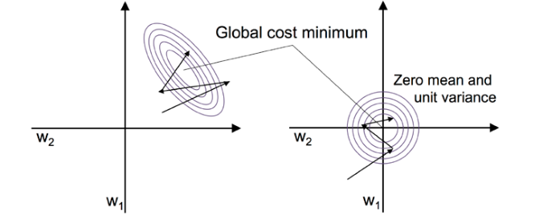

# 3. 通过标准化特征值来优化梯度下降

为什么要对特征值进行标准化呢？

举例，假如A样本的某个特征的数值为1，而B样本的这个特征值却为1000，两个样本的同一特征值相差太远，会造成在使用梯度下降，在调整该特征对应的权重时，变化过于剧烈，从而影响到整个公式的各个权重值。（我也不清楚这个理解到底是不是对的）
标准化定义，由某特征值减去该特征所属集合的期望，再除以该集合的标准差。这样可以使得各个样本的某特征值相差不是太远。
