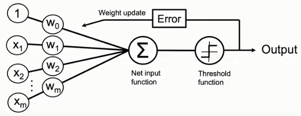

# 1. 感知机（perceptron）

>属于监督式和朴素贝叶斯算法

>多元分类：可以区分超过两种种类不同的样本，如，三种，四种不同的样本。
方法分为1v1或1vAll，但是本质上还是都利用的二元分类的方法。
>* 1v1：从有n个种类的数据中抽取两种不同的样本，一共做C_n^2次分类；
>* 1vAll：从有n个种类的数据中抽取两种来使用二元分类，第1种是随便抽取1种，然后剩下除已经抽了的一种外的其余n-1为第2种，按照次序一共做n次分类。

这是一个简单的二元分类 （指只能区分两种种类不同的样本）算法，规定数据必须线性可分，否则训练时无法停下来，该算法希望在一堆数据里面找到一条直线能使其被分成2类。
该直线定义为`Z`.

`Z=w1x1+w2x2+w3x3+w4x4+…+wnxn.`

规定：
```
φ(Z)=1,if Z >= θ
φ(Z)=-1,otherwise
```

>注:x1,x2,x3…xn为样本的各个特征，w1,w2,w3…wn为各个特征所对应的权重值。

但是`θ`到底要设多少，有些麻烦，所以改变判断条件变成了：如果`Z-θ>=0`，那么新的Z的定义改为
`Z=-θ+w1x1+w2x2+w3x3+w4x4+…+wnxn.`
这个`-θ`其实就是截距，为了统一，将`-θ`改成`w0x0`，其中`x0`其实就等于1，而`w0`则是`-θ`.

则新的定义式与判断条件则变为以下：
```
Z=w0x0+w1x1+w2x2+w3x3+w4x4+…+wnxn.
φ(Z)=1,if Z >= 0
φ(Z)=-1,otherwise
```

>（这里提醒一下，有关二分类φ(Z)到底是分为1和0，还是1或-1，是由算法决定来的，在感知机里，分成1和-1可以成功推导出来。）

为了书写方便，Z的定义用向量表示。
`Z=W^T*X`【左转右不转是为数】


## 怎么估计W



首先得初始化对应每个特征的权重`w`，可以全部初始化为0，但基本上是将权重值初始化为0附近的随机数。

然后代入各个样本的特征来训练`W`（向量）。举例如下
因为每个样本都有对应的**标签**（对应上面的“答案”或“反馈”，即该样本到底属一哪一类）。

因此在将某样本的特征（向量）与权重（向量）做内积后，再由上面的判断式来区分到底该样本属于哪一类，如果判断式判断出来的与实际上的标签值不一样，则要更新权重，否则不更新。

在二分类问题中，并且是在该感知机算法中，标签仅为1或-1，而上述算法可由公式描述为：
如果 `sign(W_t^T*X_n(t))≠y_n(t), ①`
则 `W_(t+1)=W_t+y_n(t)*X_n(t);	②`
否则不更新权重。

其中`t`表示某一次的计算，`n`表示某一个样本，`sign()`其实就是`φ(Z)`。其中要注意权重的更新公式②，`W`为向量，即每次更新都要更新所有特征所对应的权重值。

在②中，`W_(t+1)=W_t+∆W_t; ∆W_t = y_n*X_n(t)`。
而权重的更新公式还有另外一种写法：
`W_(t+1)=W_t+∆W_t; ∆W_t = η*[y(n)-y ̂(n)]*X_n(t)；③`
其中`η`为学习速率。

③与②其实本质上是一样的，除开学习速率是新增加的，③相比②只不过多了一点东西，可以通过举例来说明：

假如估计出的判断值为-1，而实际上标签值为1，那么②式的`∆W_t=1*X_n(t)`，那③式的`∆W_t`则为`1-(-1)*X_n(t)=2*X_n(t)`，实际上只是更新变更快了，最终的概念是一样的。

## 权重更新的原理
至于为何权重的更新如②所示，概念如下：

和上面的例子一样，如果判断出为-1，而实际上为+1，而根据判断式
```
φ(Z)=1,if Z >= 0
φ(Z)=-1,otherwise
```

其中的判断条件`Z`为两个向量的数量积，由余弦公式可知

`cosθ=(W^T*X)/(||W^T ||∙||X||)  ,   0<θ<180`
现在的情况是`φ(Z)=-1`，即`Z<0`,则意味着`cosθ<0`,即`90<θ<180`.
则两个向量的夹角为钝角，

这时，使用权重更新公式②：
`W^T+1*X`
原来的权重向量加上真实的标签值1乘以特征向量（该特征向量与矩阵的特征向量不同，注意区分，此处只是刚好名字是这个），可得到新的权重`W_(t+1)`。

由图可知，新的权重向量与特征向量的夹角变小了，也就意味着两向量的数量积`Z`将变大(从`Z`小于0往`Z`大于0的方向移动，而一旦大于0，那么判断出的`φ(Z)`就和正确的标签1一样了)，而从趋势上来看，将会把`φ(Z)`的值朝着正确的标签值靠拢。


## python代码实现

```
import numpy as np    
class Perceptron(object):    
"""Perceptron classifier.  
Parameters  
------------  
eta : float  
Learning rate (between 0.0 and 1.0)  
n_iter : int  
Passes over the training dataset.  
random_state : int  
Random number generator seed for random weight  
initialization.  
Attributes  
-----------  
w_ : 1d-array  
Weights after fitting.  
errors_ : list  
Number of misclassifications (updates) in each epoch.  
"""    
def __init__(self, eta=0.01, n_iter=50, random_state=1):    
    self.eta = eta    
    self.n_iter = n_iter    
    self.random_state = random_state    
  
def fit(self, X, y):    
    """Fit training data.  
    Parameters  
    ----------  
    X : {array-like}, shape = [n_examples, n_features]  
    Training vectors, where n_examples is the number of  
    examples and n_features is the number of features.  
    y : array-like, shape = [n_examples]  
    Target values.  
    Returns  
    -------  
    self : object  
    """    
    rgen = np.random.RandomState(self.random_state)    
    self.w_ = rgen.normal(loc=0.0, scale=0.01,    
    size=1 + X.shape[1])    
    self.errors_ = []    
    for _ in range(self.n_iter):    
        errors = 0    
        for xi, target in zip(X, y):    
            update = self.eta * (target - self.predict(xi))    
            self.w_[1:] += update * xi    
            self.w_[0] += update    
            errors += int(update != 0.0)    
        self.errors_.append(errors)    
    return self    
def net_input(self, X):    
    """Calculate net input"""    
    return np.dot(X, self.w_[1:]) + self.w_[0]    
def predict(self, X):    
    """Return class label after unit step"""    
    return np.where(self.net_input(X) >= 0.0, 1, -1) 

```