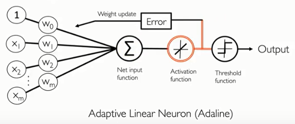
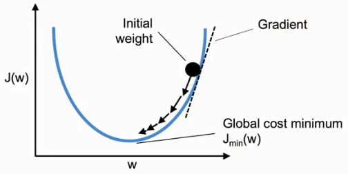
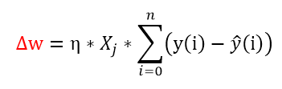

# 2. 适应性线性神经元（Adaptive linear neurons）



该分类器和感知机最大的不同是，该分类器引进了新的概念：

* 损失函数
* 梯度下降法

并且该分类器在训练`W`（向量）的时候，是一次性丢很多个样本`（n）`，比如说丢100个样本，通过计算每个样本的`Z`，然后再经过激活函数的转换，得到最终的估计值（判断值）。

之前说过引进了一个新的概念：损失函数。
>我们知道代价函数的英文是cost function，损失函数 的英文是loss function ，这两个单词都不是以字母J 开头的,
>
>那为什么代价函数习惯用 J 表示呢？
>
>这个问题众说纷纭，流传广泛的说法是J 代表雅克比矩阵(Jacobian Matrix)，雅克比矩阵是所有方向上的导数组成的矩阵，最开始有人使用了它于是大家为了一致就一直使用J 了


而在该分类器中，它的损失函数`J` 定义为（形似最小平方法），估计值与标签值的差的平分，然后再累加起来所有的样本，公式表示为：


通过梯度下降法训练调整`W`，使得损失函数J在之后的计算中能够不停地变小，即最小化损失函数的值，当`J`达到最小的时候，也就意味着，训练后的`W`在计算这100个样本时，能够很好地与真实的标签值吻合，也就完成了训练的意义。

上一章的感知机则是一个样本一个样本地测试，来调整`W`的值。

## 梯度下降原理



由上图，可以看见`J`其实是关于`W`的函数，注意`W`是一个向量，里面包含`（w0,w1…wn）`，对应有多少个特征。

而上图其实是一个简略版的图例，我们现在可以想象成`W`就是一个变量，一个值，那么假设现在`J(W)`的值位于图中黑球处，为了让`J`的值变小，如图中箭头方向，必须让`W`的值进行改变，那么改变的幅度`∆w`为：
```
W_(j+1)=W_j+∆w	①	新的W等于旧的W加上变化的幅度
∆w=-η*(dJ/dW)	②
```

`dJ/dw`在上图表示黑球处的斜率。斜率的大小在此处有什么意义我不清楚，但是它的正负值的作用却在这里说的通。

举例说明，当`J`有关`W`的函数位于图中黑球处时，此时的斜率为正，而`η`一直为正（学习速率），再加上前面的负号，整个`∆w`便变成了负数，从图中看来，刚好可以让`W`朝着曲线的凹处变小，从而让`J`值变小。

反过来说，当`J`有关`W`的函数位于图中凹线左侧时，斜率为负，`η`为正，加上前面的负号，则负负得正，`W`同样朝着曲线的凹处变大，从而让`J`值变小。

回过头来，实际上W是一个向量，所以此处该对其中的每个权重值求偏微分，然后得出的变化幅度再去加上W向量中所对应的那个权重，进而改变每一个不同的权重值。

所以公式②变为：
```
W_j=W_j+∆w      ③  W向量中某个权重(W_j)加上对应的变化幅度得到新的W_j
∆w=-η*(∂J/∂W_j) ④
```

注意③④这里的`j`和①②的`j`意思不同。

## 损失函数

由之前的定义，我们知道损失函数是有关`W`的函数，而为了使损失函数的值达到最小，我们通过梯度下降法来改变`W`的值，而其中幅度的变化使用到了偏微分，如④所示。如果我们定义损失函数为：


那么在对W求偏微分的时候，会发现二次方会放下来，而之后的运算会始终要多乘一个2，显得比较麻烦，于是为了方便，可以改变损失函数的定义，事先在前面乘以一个1/2，用来抵消掉微分后的2，即新的损失函数的定义式为：


那么对某个特征对应的权重进行偏微分后的式子如下所示：


而某个特征对应的权重的变化幅度为：



## python代码实现

```
class AdalineGD(object):  
"""ADAptive LInear NEuron classifier. 
Parameters 
------------ 
eta : float 
Learning rate (between 0.0 and 1.0) 
n_iter : int 
Passes over the training dataset. 
random_state : int 
Random number generator seed for random weight initialization. 
Attributes 
----------- 
w_ : 1d-array 
Weights after fitting. 
cost_ : list 
Sum-of-squares cost function value in each epoch. 
"""  
def __init__(self, eta=0.01, n_iter=50, random_state=1):  
    self.eta = eta  
    self.n_iter = n_iter  
    self.random_state = random_state  
  
def fit(self, X, y):  
    """ Fit training data. 
    Parameters 
    ---------- 
    X : {array-like}, shape = [n_examples, n_features] 
    Training vectors, where n_examples 
    is the number of examples and 
    n_features is the number of features. 
    y : array-like, shape = [n_examples] 
    Target values. 
    Returns 
 
    ------- 
    self : object 
    """  
    rgen = np.random.RandomState(self.random_state)  
    self.w_ = rgen.normal(loc=0.0, scale=0.01,  
    size=1 + X.shape[1])  
    self.cost_ = []  
    for i in range(self.n_iter):  
        net_input = self.net_input(X)  
        output = self.activation(net_input)  
        errors = (y - output)  
        self.w_[1:] += self.eta * X.T.dot(errors)  
        self.w_[0] += self.eta * errors.sum()  
        cost = (errors**2).sum() / 2.0  
        self.cost_.append(cost)  
    return self  
def net_input(self, X):  
    """Calculate net input"""  
    return np.dot(X, self.w_[1:]) + self.w_[0]  
def activation(self, X):  
    """Compute linear activation"""  
    return X  
def predict(self, X):  
    """Return class label after unit step"""  
    return np.where(self.activation(self.net_input(X)) >= 0.0, 1, -1)  
```