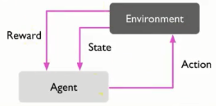

# 机器学习简介

## 1 机器学习分类

1.监督式学习

2.非监督式学习

3.强化学习

**监督式学习与非监督式学习的最大不同**

前者给答案与反馈去训练算法，后者不给，由自己去找数据里隐藏的结构。

### 1.1 监督式学习

分为两类：

* 分类;
* 回归。

### 1.2 非监督式学习

* 分群
* 降维

### 1.3 强化学习

举例子，去面试，在经过考官一系列的问题后，在这个过程中，考官不给任何反馈，直到最后，考官会根据你的表现给出评分，如果成绩不好，就要自己反思到底是过程的哪一步没做好。（大概像是这样的操作）

## 2 常用数据集--鸢尾花

* 样本：sample
* 特征：feature
* 反馈：label