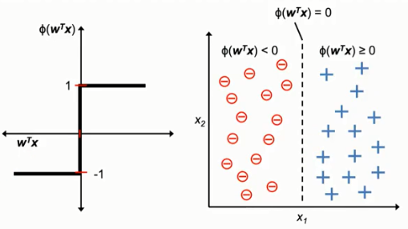
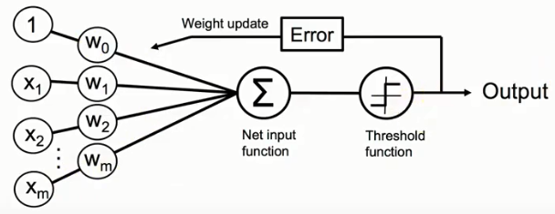

# 感知机（perceptron）

手撸基本算法，避免以后只会直接调用第三方模块的懵逼状态。

## 1 分类算法简介

多元分类：可以区分超过两种种类不同的样本，如，三种，四种不同的样本。
方法分为1v1或1vAll，但是本质上还是都利用的**二元分类**的方法。

* 1v1：从有n个种类的数据中抽取两种不同的样本，一共做C_n^2次分类；
* 1vAll：从有n个种类的数据中抽取两种来使用二元分类，第1种是随便抽取1种，然后剩下除已经抽了的一种外的其余n-1为第2种，按照次序一共做n次分类。

## 2 感知机原理--二元分类

>感知机属于监督式算法和朴素贝叶斯算法。

现在这个算法说白了就是，假如我们有一个公式：`y = k * x + b`，一条简直的直线，

我们**已知**：
* y：答案/label
* x：样本的特征/feature

**想求**：
* k：权重/weight
* b：截距/梯度

因为我们有多组`(x,y)`，通过代入公式，不停地去计算一个符合大多数情况下，`x`到`y`的映射的估计值`k`和`b`。

之后再代入一个新的`x`，就能得出一个符合之前训练情况下的`y`值了。

### 2.1 线性函数定义

这是一个简单的二元分类 （指只能区分两种种类不同的样本）算法，规定数据必须线性可分，否则训练时无法停下来，该算法希望在一堆数据里面找到一条直线能使其被分成2类。

该直线定义为`Z`：

```
Z = w1x1 + w2x2 + w3x3 + w4x4 + … + wnxn
```

人为规定：

```
φ(Z) = 1,   if Z >= θ
φ(Z) = -1,  otherwise
```

* `x1,x2,x3…xn`为样本的各个特征，
* `w1,w2,w3…wn`为各个特征所对应的权重值：**要估计的参数**。
* `φ(Z)`就是`label`答案
* `θ`：人为规定的一个阈值

但是`θ`到底要设多少，有些麻烦，我们也不知道值设为多少合适，于是通过如下变换：

```
因为 Z = w1x1 + w2x2 + w3x3 + w4x4 + … + wnxn
所以如果 Z >= θ
即 w1x1 + w2x2 + w3x3 + w4x4 + … + wnxn >= θ
将θ移到左边 w1x1 + w2x2 + w3x3 + w4x4 + … + wnxn - θ >= 0
此时令新的Z = w1x1 + w2x2 + w3x3 + w4x4 + … + wnxn - θ
即 Z >= 0
```

便可将`θ`的值也交给程序去估计，

此时，这个`-θ`其实就是截距，为了统一，将`-θ`改成`w0x0`，其中`x0`其实就等于1，而`w0`则是`-θ`.

则**新的定义式**与**判断条件**则变为以下：

```
Z = w0x0 + w1x1 + w2x2 + w3x3 + w4x4 + … + wnxn.
φ(Z) = 1,   if Z >= 0
φ(Z) = -1,  otherwise
```

>这里提醒一下，有关二分类`φ(Z)`到底是分为1和0，还是1或-1，是由算法决定来的，由感知机原理可知，分成`1`和`-1`可以成功估计出权重。

为了书写方便，`Z`的定义用向量(默认**列向量**)表示：

```
Z = W^T * X     # 左转右不转是为数，即 Z 为一个数值
```

**分类预测期待展示结果：**



### 2.2 怎么估计W




**Ⅰ：初始化W**

现在我们在某个时间点`t`，取出第`n`组样本，计算`Z`的值：

```
Z_n(t) = W_t^T * X_n(t)
```

那么首先得初始化对应该样本中每个特征的权重`w`，可以全部初始化为`0`，但基本上是将权重值初始化为`0`附近的**随机数**。

**Ⅱ：估计W与权重更新**

此时有如下判断公式：

```
sign( W_t^T * X_n(t) ) == y_n(t)    ?              
```

* `sign()`：取计算结果的正负号
* `y_n(t)`：`label`(答案)

将某样本的**特征**（向量）与**权重**（向量）做内积后，再由上面的判断式来区分到底该样本属于哪一类，如果判断式判断不一样，则要更新权重，否则不更新。

在二分类问题中，并且是在该感知机算法中，标签仅为`1`或`-1`，上述算法可由公式描述为：

```
如果 sign( W_t^T * X_n(t) ) ≠ y_n(t)            (1)
则 W_(t+1) = W_t + y_n(t) * X_n(t)              (2)
否则不更新权重。
```

其中`t`表示某一次的计算，`n`表示某一个样本，`sign()`其实就是`φ(Z)`。其中要注意权重的**更新公式(2)**，`W`为向量，即每次更新都要更新所有特征所对应的权重值。

**Ⅲ：权重更新公式第2种写法**

(2)的权重更新公式：

```
W_(t+1) = W_t + ∆W_t
∆W_t = y_n * X_n(t)                             (2)
```

可改写为(3)：

```
W_(t+1) = W_t + ∆W_t
∆W_t = η * [ y(n) - y'(n) ] * X_n(t)             (3)   # 其中`η`为学习速率。y'(n)是上一轮sign()的结果
```

(3)与(2)其实本质上是一样的，除开学习速率`η`是新增加的，(3)相比(2)只不过替换了`y_n(t)`的写法，可以通过举例来说明：

假如估计出的判断值为`-1`，而实际上标签值为`1`，那么：

* (2)式为`∆W_t = 1 * X_n(t)`,
* (3)式为`∆W_t = [1 - (-1)] * X_n(t) = 2 * X_n(t)`，

实际上只是更新变更快了，最终的概念是一样的。

### 2.3 权重更新的原理

至于为何权重的更新如公式(2)所示，可以这样解释：

和上面的例子一样，如果判断出为-1，而实际上为+1，而根据判断式：

```
φ(Z) = 1,   if Z >= 0
φ(Z) = -1,  otherwise
```

其中的判断条件`Z`为两个向量的数量积，由余弦公式可知：

```
cos(θ) = ( W^T * X ) / ( || W^T || ∙ || X || )  ,   0 < θ < 180
```

现在的情况是`φ(Z) = -1`，

1. 通过判断式可知`Z < 0`,
2. 再通过余弦公式可知`cosθ < 0`，即`90 < θ < 180`.

最终推出两个向量的夹角为**钝角**（红色向量的夹角），


此时通过权重更新公式(2)：

```
W = W^T + 1 * X
```

由**数值的方式**，可以得到一条新的向量：

原来的权重向量加上真实的标签值1乘以特征向量，可得到新的权重`W_(t+1)`。

>该特征向量与矩阵的特征向量不同，注意区分，此处只是刚好名字是这个。

再通过**图的形式**：由向量相加的平行四边形法则可知，新的向量为上图中绿色的向量，其与特征向量的夹角变小了，

也就意味着两条向量的数量积`Z`将**变大**：从`Z`小于0往`Z`大于0的方向移动（由负到正不是变大是什么）

而一旦`Z`大于0，那么判断出的`φ(Z)`就和正确的`label`值`1`一样了)，而从趋势上来看，将会把`φ(Z)`的值朝着正确的`label`值靠拢。


## 3 python代码实现

```
import numpy as np


class Perceptron(object):
    """Perceptron classifier.

    Parameters
    ------------
    eta : float
      Learning rate (between 0.0 and 1.0)
    n_iter : int
      Passes over the training dataset.
    random_state : int
      Random number generator seed for random weight
      initialization.

    Attributes
    -----------
    w_ : 1d-array
      Weights after fitting.
    errors_ : list
      Number of misclassifications (updates) in each epoch.

    """
    def __init__(self, eta=0.01, n_iter=50, random_state=1):
        self.eta = eta
        self.n_iter = n_iter
        self.random_state = random_state

    def fit(self, X, y):
        """Fit training data.

        Parameters
        ----------
        X : {array-like}, shape = [n_samples, n_features]
          Training vectors, where n_samples is the number of samples and
          n_features is the number of features.
        y : array-like, shape = [n_samples]
          Target values.

        Returns
        -------
        self : object

        """
        rgen = np.random.RandomState(self.random_state)
        self.w_ = rgen.normal(loc=0.0, scale=0.01, size=1 + X.shape[1])
        self.errors_ = []

        for _ in range(self.n_iter):
            errors = 0
            for xi, target in zip(X, y):
                update = self.eta * (target - self.predict(xi))
                self.w_[1:] += update * xi
                self.w_[0] += update
                errors += int(update != 0.0)
            self.errors_.append(errors)
        return self

    def net_input(self, X):
        """Calculate net input"""
        return np.dot(X, self.w_[1:]) + self.w_[0]

    def predict(self, X):
        """Return class label after unit step"""
        return np.where(self.net_input(X) >= 0.0, 1, -1)
```